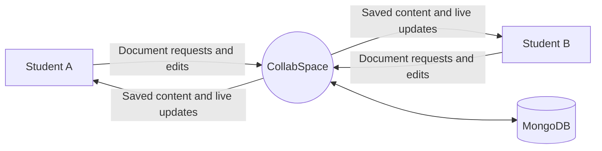
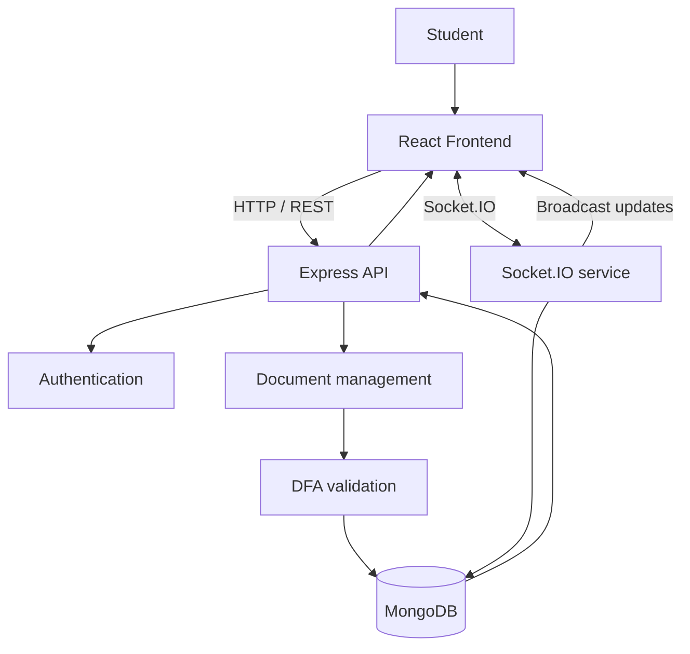

# Data Flow Diagrams

## Level 0 – Context

```mermaid
flowchart LR
  A[Student A] -->|Document requests and edits| P((CollabSpace))
  P -->|Saved content and live updates| A
  B[Student B] -->|Document requests and edits| P
  P -->|Saved content and live updates| B
  P <--> D[(MongoDB)]
```

## Level 1

```mermaid
flowchart TB
  U[Student] --> F[React Frontend]
  F -->|HTTP / REST| A[Express API]
  F <-->|Socket.IO| S[Socket.IO service]
  A --> AU[Authentication]
  A --> DM[Document management]
  DM --> DFA[DFA validation]
  DFA --> DB[(MongoDB)]
  S --> DB
  S -->|Broadcast updates| F
  DB --> A
  A --> F
```
